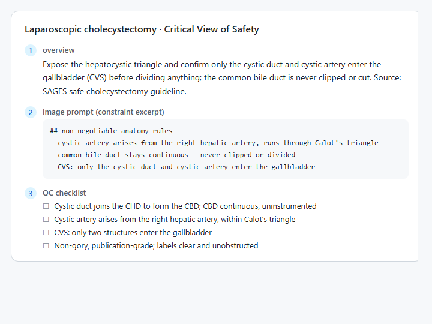
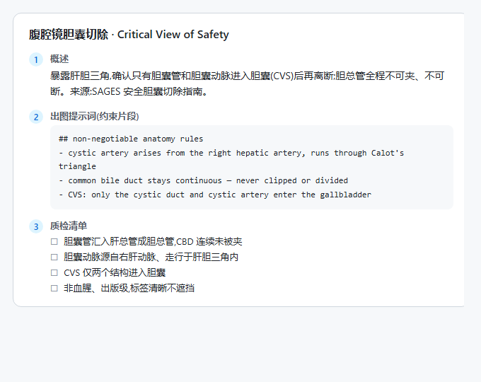
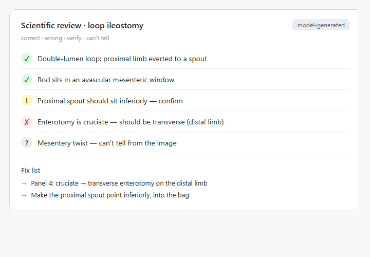

<div align="center">

# 🔬 Surgical Anatomy Illustration

**A scientific-accuracy layer for AI surgical & anatomical illustration: constrain the prompt before you draw, review the anatomy after.**

**English** · [简体中文](README.zh-CN.md)



</div>

> ⚠️ For education and publication planning only — not a clinical reference.
> Always verify anatomy against authoritative sources.

---

`surgical-anatomy-illustration` is a surgical and anatomical illustration **skill** for
**Claude Code and Codex**. It **does not generate images**: before you draw, it bakes a
procedure's non-negotiable anatomy rules and safety landmarks into the prompt; after you
draw, it reviews the figure for anatomical errors. Its priority is not looking right — it
is *being* right. What it is sure of, it judges; what is case-dependent, it flags for you.

## What it produces

| Brief to constrained prompt | Scientific review |
| --- | --- |
|  |  |
|  |  |

## Repository structure

```text
surgical-anatomy-illustration/   # the installable skill
├─ SKILL.md            # behavior: intake → brief → review
├─ knowledge/          # per-procedure anatomy constraints (JSON seed entries)
├─ scripts/            # pure-stdlib engine (no third-party dependencies)
├─ references/         # style, anatomy, composition, journal specs
└─ assets/examples/    # a worked closed-loop example
docs/                  # design notes & README images
```

## Quick install

Copy the skill folder into your Claude Code skills directory:

```powershell
# Windows PowerShell (run from the repo folder)
New-Item -ItemType Directory -Force "$env:USERPROFILE\.claude\skills" | Out-Null
Copy-Item -Recurse -Force surgical-anatomy-illustration "$env:USERPROFILE\.claude\skills\"
```

```bash
# macOS / Linux (run from the repo folder)
mkdir -p ~/.claude/skills
cp -r surgical-anatomy-illustration ~/.claude/skills/
```

Restart Claude Code, then just ask in plain language — no command needed.

## Manual install

1. Make sure the skills directory exists: `~/.claude/skills/` (on Windows,
   `C:\Users\<you>\.claude\skills\`); create it if it doesn't.
2. Put the whole `surgical-anatomy-illustration` folder there, keeping `SKILL.md`,
   `scripts/`, `knowledge/`, and `references/` intact.
3. Restart Claude Code. It auto-discovers the skill and triggers when you mention a
   surgical illustration or anatomy figure.

## Platform differences

The skill is just a set of files and runs on any host that loads skills, but **behavior
differs by host**:

| Host | Install | Entry | Behavior |
| --- | --- | --- | --- |
| **Claude Code** (recommended) | copy to `~/.claude/skills/` | ask in plain language | **Full**: pauses to run the intake, includes positioning/access, most rigorous |
| **Codex** | run inside the repo; it reads the skill | ask in plain language | **Terser**: won't pause to ask, may skip detail rules; good for a quick draft |
| **OpenClaw and other Claude Code-compatible runtimes** | same as Claude Code | same | Depends on their skill support; usually matches Claude Code |

> In short: **for the full, rigorous result use Claude Code; use Codex for a quick draft.**

## Workflows

Two parallel flows — just say what you want, no commands:

1. **Create** — give it a procedure name. It asks the few decisions that change
   correctness (side, approach, teaching focus), then returns the three-part brief:
   **Overview → Prompt → QC checklist**.
   > e.g. *"Give me the prompt and QC for a loop ileostomy."*
2. **Review** — give it any surgical/anatomy image. It scores it item by item and returns
   a short hand-fix list.
   > e.g. *"Check this surgical figure for anatomical errors."* (attach an image)

You render the prompt in whatever tool you prefer (ChatGPT, Gemini, Jimeng…) and bring the
image back for review.

## Scope

This is a **single, focused** skill — surgical and anatomical illustration only, with **no
master/branch structure**. Other medical-visualization directions (molecular/pathway
diagrams, abstract-to-figure) are planned as **separate sibling skills**, not part of this
repository.

## Key outputs

- **Overview** — what the operation is, its indication, key anatomy, and core safety point,
  with authoritative sources to verify against.
- **Prompt** — a constrained, copy-ready image prompt for any tool.
- **QC checklist** — bilingual, four-category (✅ correct / ❌ wrong / ⚠️ verify / ❓ can't
  tell), with case-dependent points flagged ⚠️ for you to decide.
- The script also writes `*_job.json`, `*_prompt.txt`, and `*_review.json`.

## Commands

You can use it by talking; to generate or check artifacts via the scripts:

```bash
cd surgical-anatomy-illustration
python scripts/knowledge.py list                 # list the seed procedure entries
python scripts/workflow.py "loop ileostomy" --output-dir outputs
```

## What it guards against

- Wrong side / laterality (left–right, superior–inferior, anterior–posterior).
- A vessel, duct, or nerve running to the wrong structure.
- Drawing a scope/variant the operation does not fix as if it were definitive — it should
  be flagged for the surgeon to decide, not guessed.
- A surgical storyboard that skips patient positioning and access (incision / trocars).
- Presenting unverified content as verified.

## Honest limits

- AI image models cannot reliably draw fine anatomy. The reliable deliverable is **a draft
  + a precise review**, not a perfect figure; an illustrator finishes the geometry.
- Knowledge entries are `model_generated` (not yet clinician-verified) unless noted.
- Not for clinical decision-making — education and publication planning only.

## License

[MIT](LICENSE).
